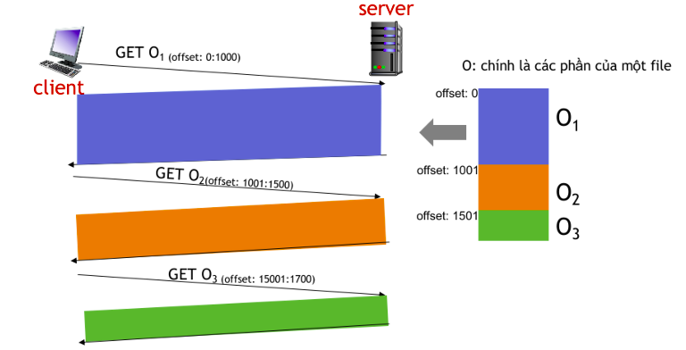

# Socket_Project

**Computer Network HCMUS, Socket Project**

**Project:** Download files using TCP and UDP at Transport layer.

**Server:**
- Using a file Text or JSON to savve list file allowing client download inlude file name and storage. Examle a file Text (.txt):

        File1.zip 5MB
        File2.zip 10MB
        File3.zip 20MB
        File4.zip 50MB
        File5.zip 100MB
        File6.zip 200MB
        File7.zip 512MB
        File8.zip 1GB

- Server will be receives from Client to download which file, from which Offset to send to Client.
- Files stored on the Server are not pre-cut into smaller files. The Server can serve file download requests from multiple clients at the same time.

**Client:**
- Client connects to the Server, Client will receive information about the list of files from the server and display it on the screen.
- To download files from the server, the client has a file to record the list of file names to be downloaded, this file is input.txt. The user will add to the end of the list of files to download in the input.txt file (do not delete the recorded file) the names of the files to download whenever they want without affecting the execution of the program (Note: can add one or more file names at a time, can use another program to open the file and add manually).
- The client is responsible for browsing the input.txt file every 5 seconds, to get the list of newly added files and download from the server. (do not download previously browsed files).

For example, input.txt file

        File1.zip
        File2.zip

(For example, File2.zip is added to the input.txt file after about 20 seconds and saves this file, the client will detect that compared to the previous reading, File2.zip is a new file that needs to be downloaded after completing the download of File1.zip)

- Each Client downloads each file sequentially according to the list in the input.txt file.
- For each file that needs to be downloaded, the client will open 4 parallel connections to the Server to start downloading parts of a file. It is possible to rely on the file size and divide by 4 to request the server to send each chunk for each connection. On the client screen, it is possible to display the % ratio (from 0-xx%) based on the download progress of the parts of the file being downloaded (Note: A client can only open 4 parallel connections to the Server to download 1 file).
Then, the client needs to join the downloaded parts of a file into a complete file. (check by checking the total size and opening the file successfully)
When the Client finishes downloading, you can press "Ctrl + C" to end the program. (https://www.tutorialspoint.com/how-do-i-catch-a-ctrlplusc-event-in-cplusplus)

Example of the Client console screen:

        Downloading File5.zip part 1 .... 45%
        Downloading File5.zip part 2 .... 15%
        Downloading File5.zip part 3 .... 25%
        Downloading File5.zip part 4 .... 85%

